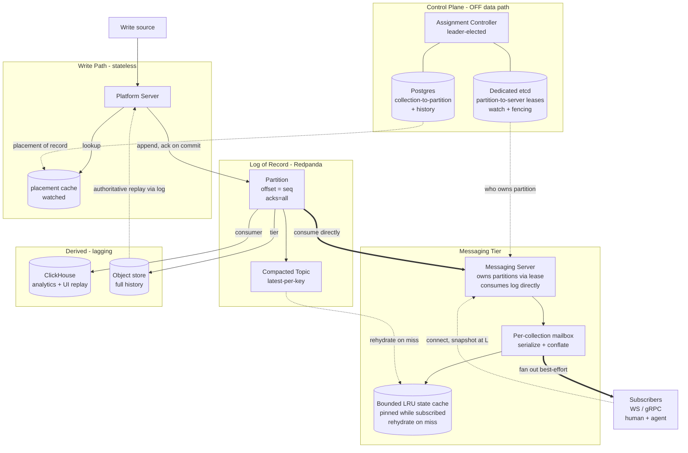
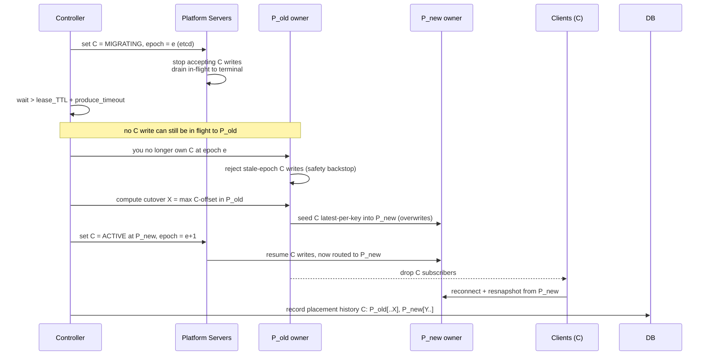

# Real-Time Ordered Distribution Engine

## Mission

A high-throughput engine that keeps an **ordered, durable, append-only audit trail per key** and **fans the latest state out to massive numbers of concurrent subscribers** (human + agent) at low latency. The engine is **payload-opaque**: it stores bytes in sequence per key and does **last-sequenced-wins on complete-state bytes** — it never interprets payloads or computes new bytes from old ones. Its simplicity is the product: provably correct, trivially recoverable, domain-agnostic. Designed to **scale to web scale by adding compute**, with every layer scaling on an independent axis.

## Architecture

- **Data model:** Tenant → Org → **Collection** → K/V (V = opaque bytes). The *collection* is the atom everything aligns on: placement, ordering, ownership, subscription. One collection = one partition = one ordered lane. Too hot? The **user shards their own keyspace** into more collections; the engine never splits a collection.
- **Write path (stateless):** write → platform server → append to the log partition for its collection. Offset = sequence number. Ack only on **durable commit** (`acks=all`), so fan-out can never emit a phantom.
- **Log = single source of truth + audit trail.** Ordered per partition; no cross-partition ordering. Compacted topic per partition holds latest-per-key.
- **Messaging tier:** each server **owns partitions via an etcd lease** and consumes them directly. A **per-collection actor mailbox** serializes updates + registrations (and conflates on overflow) — this serialization makes snapshot/stream handoff correct for free.
- **In-memory state = a bounded cache, not source of truth.** Latest-per-key maps are held **only for collections with live interest**, so memory scales with *active subscriptions*, not *owned collections* (owning a partition with no watchers costs zero RAM — just a consumer offset). Implemented as a **byte-weighted LRU with a hard cap**: **pin** any collection with ≥1 subscriber (never evict live state); **LRU-evict** only cold, unsubscribed collections; **rehydrate on miss** from the compacted topic (view-at-V then catch-up from V+1 — the *same* path as ownership failover). App-level eviction only — **never OS swap**. Size the cap above the steady active working set; LRU handles the margin, not the bulk.
- **Fan-out:** best-effort to WebSocket / gRPC subscribers (`collection + optional key-filter`). Under load, conflate to latest. **A slow consumer never back-pressures the log or sequencer.**
- **Registration:** connect (routed at connect-time) → snapshot at offset L from the **in-memory cache** (rehydrated from the compacted topic on miss; never from the lagging OLAP store) → stream L+1 onward → **on any error, reconnect + resnapshot**.
- **Placement:** `collection → partition` is an **explicit, load-aware mapping in Postgres** (not modulo hash), so partition count grows append-only and existing collections never rehash. Cached at platform servers, invalidated on change.
- **Ownership:** `partition → server` **leases in dedicated etcd** (native lease + watch + revision-fencing). Scales with servers/partitions, isolated from the k8s control plane so it never becomes a bottleneck. Sub-second failover.
- **Derived read models (lagging, decoupled):** log consumers project into **OLAP** (analytics + UI replay) and **cold storage** (full history). Rebuildable from offset 0. **Authoritative replay reads the log; convenient replay reads OLAP.**
- **Control plane (off the data path):** a single **assignment controller** — run as replicas with **one leader election among them** (the *only* election in the system) so exactly one is active — watches load + liveness and writes `partition → server` assignments and migrations. Control plane down ≠ data plane down (existing assignments keep serving; only *changes* pause).
- **Partition ownership is assigned, not elected.** The controller decides owners top-down; servers don't campaign. The etcd lease on a partition is a **liveness mechanism** (owner renews; expiry → controller reassigns), not a per-partition consensus round. This keeps coordination churn proportional to *events* (a death, a rebalance), never to *partition count*.
- **Scaling axes (independent):** Redpanda by partitions/brokers · messaging tier by pods · Postgres off-hot-path + read replicas · etcd sharded by tenant/region when coordination churn demands it (keys prefixed for that split from day one; etcd write load stays proportional to *coordination events*, never *traffic*).

## Locked-in tech stack

| Concern | Choice | Notes |
|---|---|---|
| Language / runtime | **Kotlin + Ktor + coroutines** | Actor-mailbox = coroutine/Channel sweet spot |
| Log of record | **Redpanda** | Kafka-API, no ZK/JVM, native tiered storage; offset = seq |
| Placement + history | **Postgres** | `collection → partition`, high-cardinality, query-shaped, cached |
| Coordination | **Dedicated etcd** | `partition → server` leases, watch, `ModRevision` fencing, controller election |
| OLAP sink | **ClickHouse** | Derived, rebuildable projection |
| Cold archive | **S3-compatible object store** | Interface, not vendor: MinIO/Hetzner now → R2/S3/GCS later. Replay-friendly |
| Client transport | **gRPC (pods) / WebSocket (browsers)** | One binary framing over both |
| Serialization | **Fixed binary envelope + opaque payload** | Envelope = versioned ABI; payload app-owned |
| Orchestration | **Commodity Kubernetes (k3s / Talos)** | Long stateful WS connections; bin-pack pods; same manifests run on any managed k8s later |

**Portability goal.** Run on cheap commodity compute (no egress/PoC tax, healthy margins) while staying **trivially movable** to any managed k8s (GKE/EKS) if a business grows to justify it. This is achieved by discipline, not just tooling:
- **Compute + deployment move for free.** App is Docker + **vanilla k8s manifests / Helm** — zero cloud-specific resources in the app layer. Terraform is split into a small **swappable per-provider infra module** (cluster, node pools, buckets, DB) and a large **provider-agnostic app module** that takes a kubeconfig + connection strings as inputs. Moving providers = swap the infra module; the app layer is byte-identical. Provider quirks (StorageClass, LoadBalancer/ingress annotations) are isolated in per-environment overlays.
- **Every stateful dependency is a standard protocol with a self-hosted default and a managed upgrade path:** log = **Kafka API** (self-hosted Redpanda → Redpanda Cloud/MSK), object store = **S3 API** (MinIO → R2/S3/GCS), **Postgres** wire (CloudNativePG → Neon/RDS), **ClickHouse** wire (self-hosted → ClickHouse Cloud). Flipping to managed is an infra-layer + connection-string change, never an app change.
- **Data migration is a designed runbook, not a variable flip.** Code moves trivially; *bytes do not teleport.* Because the log tiers to object storage and all derived stores are **rebuildable projections**, relocating a deployment is a scripted "stand up new stack → restore/replay from object storage → cut over" runbook — tractable and repeatable, but an explicit operation, not free. Everything must stay rebuildable-from-log for this to hold.

## Steady-state architecture

## Migrating a collection to a different partition

Move collection C from `P_old` to `P_new` without breaking per-key order. **The fence is the whole correctness story:** in-flight writes are drained, and the cutover offset is *observed after* the drain, never declared. Timing gives liveness; the epoch-reject gives safety.

**Notes:** state machine is etcd-persisted and idempotent (crash → new leader resumes). Frozen writes return retryable; retries land on `P_new` and are safe under LWW / write-id dedup. Authoritative replay stitches the placement-history boundary.

---

## Design review — open issues (to fix)

*Added from design review. Ordered roughly by severity. See also "Proposed migration redesign" below, which addresses the first cluster.*

### Correctness

- [ ] **Epoch fence is in the wrong place.** Writes go platform server → broker directly, but the migration protocol has the *old messaging-tier owner* rejecting stale-epoch writes. The old owner is a consumer — it isn't in the write path and can't reject a produce. A platform server with a stale placement cache can append collection-C writes to `P_old` *after* cutover X, violating per-key order. Safety currently rests entirely on the timing wait. Fix: fence at produce/ack time (see redesign below).
- [ ] **Compacted topic is underspecified but load-bearing.** The main partition is the infinite audit trail, so it can't itself be compacted — the "compacted topic" must be a second, derived topic. Unanswered: who produces it, with what lag and failure mode? Its offsets are not the log's offsets, so "view-at-V then catch-up from V+1" only works if each compacted record embeds the original log offset. This is the rehydration path, the failover path, *and* the migration seed source — needs full design.
- [ ] **Stale-retry LWW anomaly at migration.** A write frozen pre-migration and retried post-cutover can land *after* a genuinely newer write to the same key on `P_new` and win under last-sequenced-wins. Write-id dedup is mentioned but not designed (where does dedup state live, what retention?). Kafka idempotent producers don't cover retries that switch partitions.
- [ ] **Seeding pollutes the log of record.** Copying latest-per-key *into* `P_new` puts synthetic duplicates in the audit trail; replay and OLAP will double-count unless every consumer is seed-aware. Either tag seeds with origin metadata everywhere, or (better) never seed the log — seed only derived state (see redesign).

### Availability & load

- [ ] **Migration write-freeze is unbounded.** Freeze = drain wait + full latest-per-key copy, proportional to key cardinality (user-controlled). Our only remedy for a hot partition requires an outage proportional to the hot thing. Fix: pre-warm the new owner before fencing (see redesign).
- [ ] **Pinned LRU set is unbounded → OOM, not a cache.** "Never evict live state" + "memory scales with active subscriptions" means one tenant subscribing to a huge number of cold collections blows the hard cap, with no defined behavior. Need per-tenant subscription/pinned-byte quotas and a defined degrade mode (refuse registration, or snapshot-on-demand without pinning).
- [ ] **Thundering herd on owner death.** Server dies → all its subscribers reconnect at once → new owners cold-rehydrate many collections while serving a snapshot storm. Lease failover is sub-second; *service* failover is not. Need reconnect jitter, snapshot coalescing (one rehydration serves N waiting registrants), possibly warm standbys.
- [ ] **Head-of-line blocking within a partition.** One hot collection delays consumption/fan-out for every collection sharing the partition, and the fix (migration) is heavyweight. Need per-tenant/collection produce quotas at minimum.

### Contract & semantics

- [ ] **Promised "ordered audit trail," delivered a conflated stream.** Fan-out and mailboxes conflate by design, so live subscribers get gaps. Fine — but state the contract explicitly: fan-out = at-least-latest state per key, never contiguous events; consumers needing every event replay the log. Also state: "order" = broker arrival order across concurrent platform servers, not client causal order; no CAS/conditional writes.
- [ ] **Deletes don't exist.** No tombstone semantics defined for the compacted topic, LRU, snapshots, fan-out, or infinite retention. Touches every layer.

### Operational realism

- [ ] **"etcd sharded by tenant/region" is hand-waving.** etcd doesn't shard; that's N independent clusters, and the single leader-elected controller's election lives in exactly one. Also: etcd outage + server death simultaneously = dead server's partitions unserved until etcd returns — contradicts "control plane down ≠ data plane down" in the case that matters.
- [ ] **Missing sections entirely:** authn/authz + tenant isolation (tenants share brokers and servers); payload size limits + envelope versioning policy; DR/geo story (single region, RPO/RTO undefined — "rebuildable from object storage" is the DR plan but the runbook is only sketched for migration, not loss); observability for correctness invariants (fence rejections, cache-cap pressure, compacted-topic lag as first-class alerting metrics).

**Top three before more code:** produce-time fencing hole, compacted-topic design, unbounded pinned set. The first two are safety violations in the "provably correct" story the product sells.

---

## Proposed migration redesign (replaces current migration section once agreed)

Fixes the fencing hole, the unbounded freeze, and log pollution. Three prerequisites, then the protocol.

**1. Leased placement, fenced at the ack.** Every placement cache entry `(C → P, epoch e)` is a lease (TTL ~1–2s, renewed via watch/heartbeat). A platform server may only *ack* a C write while holding a valid lease at epoch e — check epoch before append, stamp epoch in the envelope, re-check lease before acking; if the re-check fails, return retryable-unacked. Consumers apply one deterministic rule: epoch e is *closed at offset X*; any epoch-e record for C past X is skipped by every consumer (messaging tier, compaction, OLAP, replay). Such a record can only exist if its ack was suppressed, so discarding it loses nothing. Safety no longer rests on timing; the lease TTL only bounds freeze duration.

**2. Placement-history-aware state; never seed the log.** `state(C) = fold(P_old[..X]) ⊕ fold(P_new[Y..])`. `P_new` stays a pure audit trail. To avoid chain-walking segments at rehydration, write a derived **checkpoint** `state-at-X` keyed `(C, epoch)` at each migration (object store or snapshot topic); rehydrate = checkpoint + tail. Checkpoints are rebuildable; missing one falls back to the segment fold. Also fixes rehydration cost for long-lived collections generally.

**3. Pre-warmed follower.** The designated new owner builds C's state *before* any freeze: rehydrate, then tail `P_old` live (filtered to C). By fence time it's caught up to within milliseconds; the freeze contains no state copy.

**Protocol phases:**

1. **PREPARE** (no freeze): follower warms up; proceed when catch-up lag < ε.
2. **FENCE**: controller bumps epoch → e+1, C = MIGRATING. Barrier = all live platform servers acked the bump (fast path, tens of ms), lease TTL as ceiling for stragglers. No epoch-e ack possible after the barrier.
3. **OBSERVE X**: read `P_old` end-of-partition *after* the barrier. X is observed, never declared; post-X stragglers were never acked and are skipped by rule.
4. **SEAL** (commit point): persist segment record `C: P_old[e, ..X] → P_new[e+1, Y..]` in Postgres. Checkpoint write is async; correctness never waits on it.
5. **OPEN**: C = ACTIVE at `P_new`, epoch e+1. Retries carry the original write-id in the envelope; the one ambiguous case (epoch-e append landed ≤ X but ack suppressed, then retried to P_new) yields a write-id-collapsible duplicate that is idempotent for state anyway.
6. **HANDOFF** (no drop-and-storm): old owner sends subscribers a redirect carrying `version = (e, X)`; versions order as (epoch, offset) tuples so they stay monotonic across the partition change. New owner serves from its warm cache, coalescing snapshot requests; a client presenting exactly `(e, X)` skips the snapshot and streams from Y.

**Write unavailability = barrier + X-read + one Postgres write** — sub-second, independent of collection size and key cardinality.

**Failure analysis:** controller death → idempotent state machine in etcd/Postgres, new leader resumes (crash before SEAL: roll forward or back; re-observing X after the barrier is idempotent). New owner dies in PREPARE → pick another follower, nothing was frozen. Dies after SEAL pre-checkpoint → successor uses segment fold (slow, correct). Platform server partitioned during FENCE → lease expires, it can't ack, barrier completes without it. Old owner dies mid-migration → X is a broker offset, not owner state; anyone can read it, and the follower tails the broker, not the owner.

**Invariants to alert on:** zero epoch-e acks after barrier; exactly one ACTIVE epoch per collection, bounded MIGRATING age (a stalled FENCE is a live outage); skipped post-X records rare and logged; checkpoint lag behind sealed segments.

**Fallback option (document, don't build yet):** route writes through the partition's messaging-tier owner, making it a true sequencer — fencing becomes a local epoch check, X is its own high-water mark, and CAS comes nearly free — at the cost of write-path statelessness and one hop. Keep as the designated escape hatch if lease management proves hairy.

---

## Strategic review — is this worth building?

*Added from review. The architecture review above covers "does it work"; this covers "should it exist." The biggest gap in this document is not a correctness bug — it's that there is no section titled "why we can't buy this."*

### The case for

- The design has taste: log-as-truth, rebuildable projections, independent scaling axes, coordination cost proportional to events not traffic. As internal infrastructure for a product with a demonstrated workload, it's a defensible build.
- The primitive (ordered durable audit trail per key + latest-state fan-out at scale, payload-opaque) is genuinely useful.

### The case against (unanswered)

- [ ] **No build-vs-buy analysis exists.** The system is deliberately an assembly of commodity parts in a crowded neighborhood. Required before more engineering-years:
  - **NATS JetStream + KV**: ordered streams, last-value-per-key, watch semantics, huge fan-out, one binary. Articulate precisely what this engine does that JetStream KV doesn't, and whether the delta justifies the build.
  - **Kafka/Redpanda + compacted topics + thin WS gateway**: the DIY version that any team sophisticated enough to *evaluate* this product could build themselves.
  - **Ably / PubNub / Cloudflare Durable Objects / Firebase-class**: own the convenience buyer who doesn't want to think about partitions.
- [ ] **Positioning squeeze.** "Simple, unopinionated, payload-opaque" selects for sophisticated infra buyers — exactly the segment most likely to DIY. Meanwhile "user shards their own keyspace" is a real DX tax that opinionated competitors don't charge, losing the convenience buyer. Too low-level for one segment, too replicable for the other. Buyers purchase solved problems, not engineering virtues.
- [ ] **No numbers.** Worth-building is a function of target write QPS, fan-out ratio, latency budget, subscriber counts, and a cost model. Fan-out egress is the real cost driver and is absent from the doc entirely.

### The plausible wedge

- The doc says "human + agent" subscribers in passing — take it seriously. Massive fleets of *agents* watching shared, ordered, auditable state is a growing workload that existing realtime products are mispriced for (pricing assumes human-scale concurrency) and mis-designed for (semantics assume UI sync; audit-trail-with-replay is rarely first-class).
- In that framing, the decisions already made (audit trail *is* the log, replay from offset 0, payload-opaque) stop being generic virtues and become the pitch: agents catch up, verify, and coordinate *through* the trail.
- [ ] **Action:** spend ~a week pressure-testing the agent-coordination-substrate framing before writing more Kotlin.

### Verdict (compressed)

- Internal infra for a real workload: **conditionally yes**, pending a written build-vs-buy where NATS JetStream and one managed competitor are genuinely made to fail against concrete requirements.
- Standalone general-purpose product: **no** — the squeeze is real, the moat is thin.
- Agent-coordination substrate with the audit trail as hero feature: **plausibly yes** — this is the version worth a week of validation.
